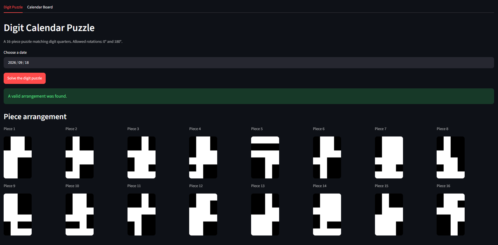
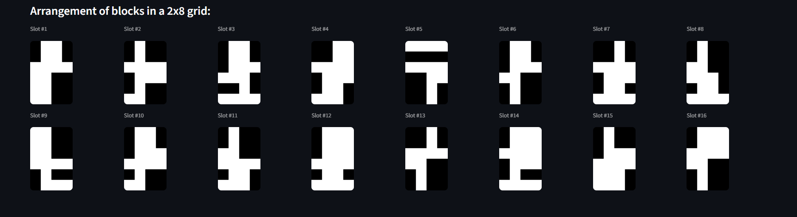

# Callendarium Puzzle Solver

A Streamlit-based application designed to solve date-matching grid puzzles using a recursive backtracking algorithm.






## Requirements

- Python 3.9 or higher
- `pip` package manager

## Quick Start

### Linux / macOS

Run the shell script. It automatically handles virtual environment creation, dependency installation, and server startup on the first run:

```bash
chmod +x run.sh
./run.sh
```

### Windows

Double-click `run.bat` or execute it directly in Command Prompt (CMD):

```dos
run.bat
```

## Manual Setup

If you prefer setting up the project manually:

1. Create and activate a Python virtual enviroment:

```bash
python3 -m venv venv
source venv/bin/activate  # On Windows: venv\Scripts\activate
```

2. Install dependencies:

```bash
pip install -r requirements.txt
```

3. Launch the Streamlit application:

```bash
streamlit run app.py
```

The application will automatically open in your default browser at `http://localhost:8501.`

## Subsequent Runs

Once the environment is installed, running `./run.sh` or `run.bat` again will skip installation and launch the app immediately.

Alternatively, reactivate the environment manually:

```bash
source venv/bin/activate  # On Windows: venv\Scripts\activate
streamlit run app.py
```
