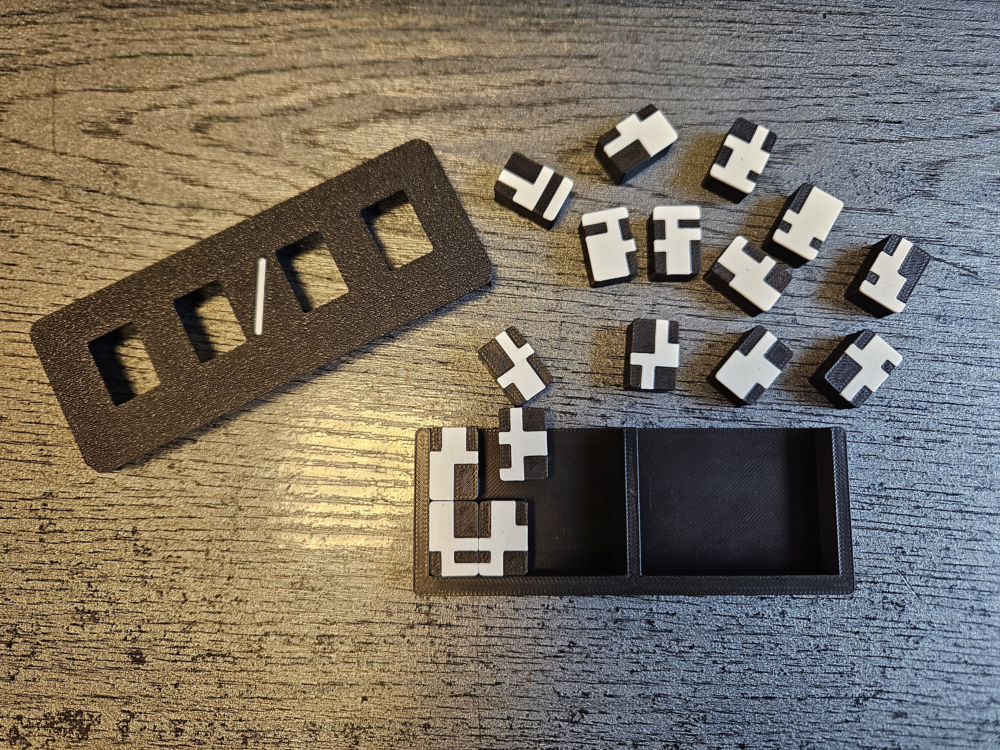
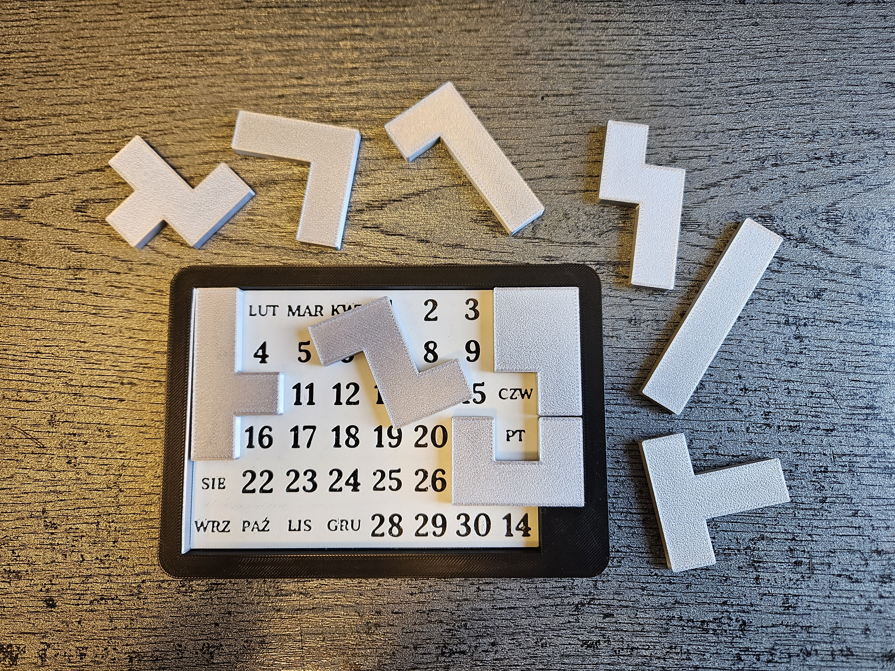
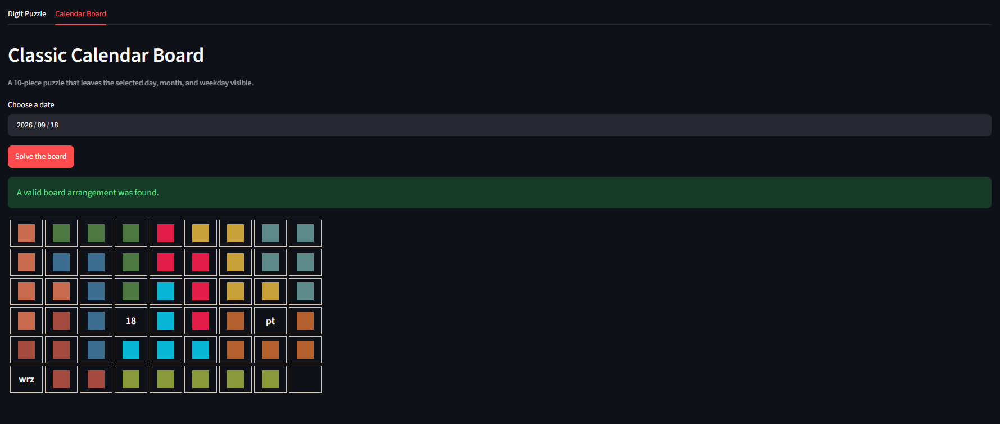

# Calendar Puzzle Solver

A Streamlit application for solving two related calendar-themed puzzles. Both solvers are available from one interface through separate tabs.

## Puzzles and Solver Results

<table>
<tr>
<td width="50%" align="center">
<strong>Digit calendar puzzle</strong><br>

</td>
<td width="50%" align="center">
<strong>Board calendar puzzle</strong><br>

</td>
</tr>
</table>

<table>
<tr>
<td width="50%" align="center">
<strong>Digit puzzle solver</strong><br>

</td>
<td width="50%" align="center">
<strong>Calendar board solver</strong><br>

</td>
</tr>
</table>

## Features

- One Streamlit application for both puzzles.
- Separate `Digit Puzzle` and `Calendar Board` tabs.
- Date selection with an automatic weekday calculation.
- Backtracking solvers for both puzzle types.
- Digit puzzle support for 0° and 180° rotations.
- Calendar board support for unique 0°, 90°, 180°, and 270° rotations.
- Visual result rendering directly in the browser.
- Command-line output for the calendar board solver.
- Windows and Linux/macOS launch scripts.

## Project Structure

| File                     | Purpose                                                                                                         |
| ------------------------ | --------------------------------------------------------------------------------------------------------------- |
| `app.py`                 | Streamlit application entry point and tab layout.                                                               |
| `digit_solver.py`        | Digit puzzle data and backtracking algorithm.                                                                   |
| `digit_view.py`          | Streamlit view for the digit puzzle.                                                                            |
| `board_solver.py`        | Calendar board data, rotations, and backtracking algorithm.                                                     |
| `board_view.py`          | Streamlit view for the calendar board. Polish month and weekday labels remain part of the physical board model. |
| `puzzle_board_solver.py` | Command-line entry point for the calendar board solver.                                                         |
| `requirements.txt`       | Python dependencies.                                                                                            |
| `run.bat`                | Windows setup and launch script.                                                                                |
| `run.sh`                 | Linux/macOS setup and launch script.                                                                            |
| `Screenshots/`           | Project images and solver previews used in the README.                                                          |

## Requirements

- Python 3.9 or newer
- `pip`

## Quick Start

### Windows

Double-click `run.bat`, or run it from Command Prompt:

```bat
run.bat
```

### Linux or macOS

```bash
chmod +x run.sh
./run.sh
```

The launcher creates a virtual environment, installs the dependencies, and starts Streamlit at:

```text
http://localhost:8501
```

## Manual Setup

```bash
python -m venv venv
```

Activate the environment:

```bash
# Windows
venv\Scripts\activate

# Linux/macOS
source venv/bin/activate
```

Install dependencies and start the application:

```bash
pip install -r requirements.txt
streamlit run app.py
```

## Command-Line Usage

The calendar board solver can also be run without Streamlit:

```bash
python puzzle_board_solver.py 2026-09-18
```

The command prints the solved board and the selected date. The Polish month and weekday labels shown in this output match the physical puzzle board.

## How the Solvers Work

Both solvers use recursive backtracking.

### Digit Puzzle

The selected date is converted into digit quarters. Each of the 16 pieces is tested against the required quarter, using the original piece and its 180° rotation. The first complete assignment using every piece is returned and rendered as a 12 × 32 grid.

### Calendar Board

The selected month, day, and weekday are marked as uncovered cells. The remaining cells are filled with the 10 pieces. Each piece is tested in every unique rotation and placement until the board is complete.
